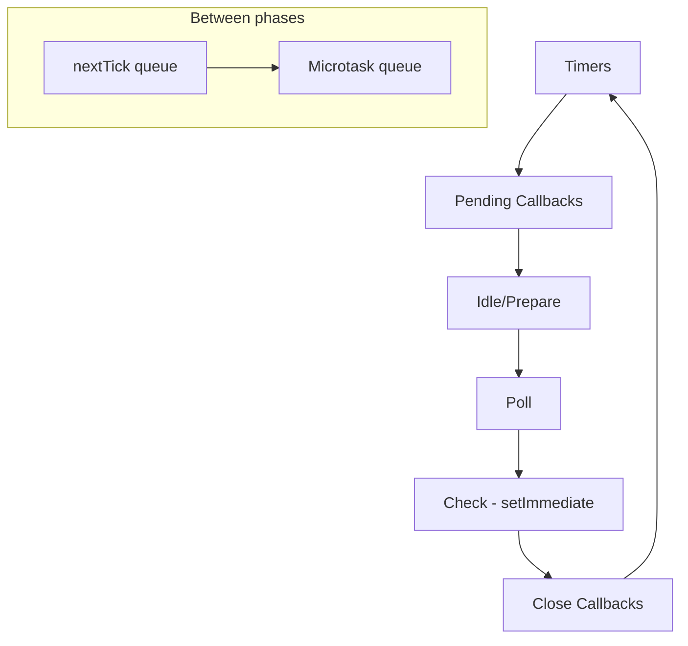
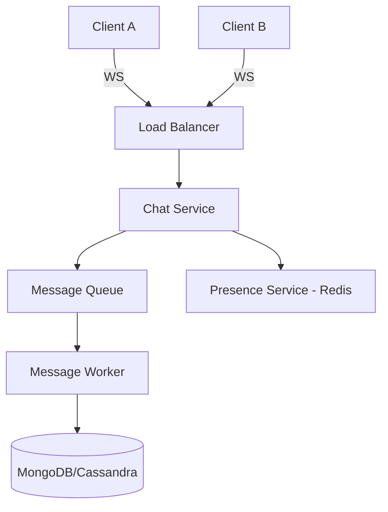

```markdown
# MERN Stack Interview Deep Dive

## JavaScript Core

### 1. What is Hoisting? (with Temporal Dead Zone and function hoisting details)

**Difficulty:** Easy | **Frequency:** ★★★★★

#### Answer
Hoisting is JavaScript's default behaviour of moving variable, function, and class declarations to the top of their scope during the compilation phase, before code execution. This means you can use a variable before its declaration without getting a `ReferenceError` (the value may be `undefined` or result in TDZ error).

- `var` declarations are hoisted and initialised to `undefined`.
- `let` and `const` declarations are hoisted but remain uninitialised. Accessing them before the actual declaration line throws a `ReferenceError`. The period between entering the scope and the declaration is called the **Temporal Dead Zone (TDZ)**.
- Function declarations are hoisted completely – both name and body are available.
- Function expressions are not hoisted as functions; they follow the hoisting rules of the variable to which they are assigned.
- Class declarations are hoisted like `let` (TDZ applies).

#### Example
```javascript
console.log(name); // undefined
var name = 'John';

sayHello(); // "Hello"
function sayHello() { console.log('Hello'); }

// TDZ example
console.log(age); // ReferenceError: Cannot access 'age' before initialization
let age = 30;
```

#### Why?
The JavaScript engine performs two passes: first it parses and sets up the execution context, allocating memory for declarations. This enables some flexibility, but also led to bugs with `var`. `let`/`const`'s TDZ was introduced to make variable access more predictable.

#### Internal Working
During the **creation phase** of an execution context, the engine:
- Creates a **LexicalEnvironment** record.
- For `var`, creates binding and initialises it with `undefined`.
- For `let`/`const`, creates binding but marks it as "uninitialised"; only after execution reaches the declaration does it become initialised.
- Function declarations are initialised completely at creation.

#### Common Mistakes
- Believing `let` and `const` are not hoisted at all.
- Accidentally accessing a `var` before assignment and getting `undefined`.
- Forgetting that function expressions (assigned to `var`) only hoist the variable, not the function.
- Placing class usage before its declaration.

#### Best Practices
- Always declare variables at the top of their scope.
- Use `const` by default, `let` only when reassignment needed.
- Avoid `var` to eliminate hoisting-related bugs.
- Enable ESLint rules like `no-use-before-define`.

#### Interview Follow-up Questions
- *Difference between `let` and `var`?*  
  `var` is function-scoped, hoisted with `undefined`; `let` is block-scoped, hoisted but uninitialised (TDZ).
- *What is TDZ?*  
  The state where variables exist but cannot be accessed until declaration.
- *Are function expressions hoisted?*  
  Only the variable to which they are assigned is hoisted; if it's `var`, it's `undefined`; if `let`/`const`, it's in TDZ.
- *How do class declarations hoist?*  
  Like `let`, with TDZ.

#### Revision Notes
- Hoisting = declaration moved to top in compilation.
- `var` → `undefined`; `let`/`const` → TDZ.
- Function declarations fully hoisted.
- Always declare first, then use.
- Use `const`/`let` to avoid surprises.

---

### 2. Event Loop, Task Queues, and Microtasks (In-depth)

**Difficulty:** Hard | **Frequency:** ★★★★

#### Answer
The JavaScript event loop is the mechanism that allows Node.js/ browser to perform non-blocking I/O despite being single-threaded. It consists of:

- **Call Stack**: where function execution frames live.
- **Task Queue (Macrotask Queue)**: holds tasks like `setTimeout`, `setInterval`, I/O callbacks, UI rendering.
- **Microtask Queue**: holds Promises `.then/catch/finally`, `queueMicrotask()`, `MutationObserver`.

The event loop continuously checks if the call stack is empty, then:
1. Takes **all** microtasks from the microtask queue and executes them.
2. Takes **one** macrotask from the task queue and executes it.
3. Repeats.

This means microtasks run before the next macrotask, and if microtasks keep adding more microtasks, they'll starve the macrotasks.

#### Example
```javascript
console.log('script start');

setTimeout(() => console.log('setTimeout'), 0);

Promise.resolve()
  .then(() => console.log('promise1'))
  .then(() => console.log('promise2'));

console.log('script end');

// Output:
// script start
// script end
// promise1
// promise2
// setTimeout
```
**Explanation:** `script start` and `script end` run synchronously. The `setTimeout` callback is a macrotask, placed in the task queue. Promises are microtasks, put in the microtask queue. After the script finishes, microtasks are drained (`promise1`, `promise2`), then the macrotask (`setTimeout`) runs.

#### Node.js Specifics
Node's event loop has multiple phases: timers, pending callbacks, idle/prepare, poll, check, close callbacks. `process.nextTick()` callbacks run before any microtasks, and microtasks are processed between each phase.

#### Why?
The event loop enables concurrency without threads. It keeps the UI responsive and handles thousands of connections efficiently.

#### Internal Working
When an async operation completes, its callback is queued in the appropriate queue. The event loop picks up tasks based on phase order and queue priority (microtask > nextTick > macrotask).

#### Common Mistakes
- Assuming `setTimeout(fn, 0)` executes immediately.
- Blocking the event loop with heavy synchronous operations (e.g., large loops, `JSON.parse` on huge data).
- Creating infinite microtask loops (e.g., recursively calling Promise.then).

#### Best Practices
- Break long-running tasks into chunks using `setTimeout`/`setImmediate` or worker threads.
- Avoid synchronous I/O in production.
- Use `async/await` to keep code clean but understand it still relies on microtasks.

#### Interview Follow-up Questions
- *Difference between microtask and macrotask?* Microtasks have higher priority, run before next macrotask.
- *What is `process.nextTick()`?* It queues a callback to be executed immediately after the current operation, before any microtasks.
- *How does `requestAnimationFrame` fit?* In browsers, it runs before the next repaint, within the event loop but after microtasks.

#### Revision Notes
- Call stack, task queue, microtask queue.
- Microtasks always before next macrotask.
- `Promise` callbacks are microtasks.
- `setTimeout` callback is macrotask.
- `nextTick` in Node runs before microtasks.
- Don't block the event loop.
- Starvation possible with continuous microtasks.

---

### 3. Closures: Practical Uses and Garbage Collection

**Difficulty:** Medium | **Frequency:** ★★★★★

#### Answer
A closure is created when a function "remembers" its lexical scope even when the function is executed outside that scope. In JavaScript, every function is a closure. The inner function maintains a reference to the outer function's variables, preventing them from being garbage collected.

#### Example
```javascript
function createCounter() {
  let count = 0;
  return {
    increment: function() { return ++count; },
    decrement: function() { return --count; },
    getCount: function() { return count; }
  };
}
const counter = createCounter();
counter.increment(); // 1
counter.increment(); // 2
counter.decrement(); // 1
```
`count` is private, accessible only through the returned methods.

#### Real-world Applications
- **Module pattern**: Encapsulate private data.
- **Currying and partial application**: Preset arguments.
- **Event handlers**: Access surrounding state.
- **Memoization**: Cache results.
- **React hooks**: `useState`, `useEffect` rely on closures to capture state values.

#### Memory Consideration
Closures can cause memory leaks if they hold references to large objects that are no longer needed. For instance, storing DOM elements in a closure that outlives the DOM can prevent garbage collection.

#### Common Mistakes
- Creating closures inside loops with `var` leading to incorrect value capture.
  ```javascript
  for (var i = 0; i < 3; i++) {
    setTimeout(() => console.log(i), 0); // prints 3,3,3
  }
  // Fix: use let, or IIFE.
  ```
- Unintentional memory leaks when closures retain huge objects.
- Not releasing event listeners that reference closure variables.

#### Best Practices
- Use `let` for block scoping in loops.
- Clean up closures (e.g., remove event listeners) when component unmounts.
- Avoid capturing large data if not necessary.

#### Interview Follow-up Questions
- *How to fix loop closure problem?* Use `let` or an IIFE.
- *Can you explain module pattern?* Using an IIFE that returns an object with closures over private variables.
- *How does garbage collection work with closures?* If the inner function is still reachable, its scope (and anything referenced) cannot be collected.

#### Revision Notes
- Closure = function + its lexical environment.
- Enables data privacy.
- Common in React hooks.
- Watch for memory leaks.
- Fix loop issue with `let` or IIFE.
- Used in currying, memoization.

---

### 4. `this` Keyword Deep Dive

**Difficulty:** Medium | **Frequency:** ★★★★★

#### Answer
`this` is a dynamic keyword whose value is determined by how a function is called, not where it is defined. Rules in order of precedence:

1. **`new` binding**: When a function is called with `new`, `this` refers to the newly created object.
2. **Explicit binding**: Using `call`, `apply`, or `bind`, `this` is explicitly set.
3. **Implicit binding**: When a function is called as a method of an object, `this` points to that object.
4. **Default binding**: In non-strict mode, `this` defaults to the global object (`window`/`global`); in strict mode, it's `undefined`.
5. **Arrow functions**: They do not have their own `this`; they inherit `this` from the enclosing lexical scope (where they were defined).

#### Example
```javascript
const obj = {
  name: 'Alice',
  greet: function() {
    console.log(this.name);
  },
  greetArrow: () => console.log(this.name)
};

obj.greet(); // 'Alice' (implicit)
obj.greetArrow(); // undefined (arrow: lexical `this` is global)

function show() {
  console.log(this);
}
show(); // global (or undefined in strict)

const boundShow = show.bind({ id: 1 });
boundShow(); // { id: 1 }
```

#### React and `this`
In class components, methods often lose implicit binding when passed as callbacks, so we need `bind` in constructor or use arrow functions as class properties.
```jsx
class MyComponent extends React.Component {
  constructor(props) {
    super(props);
    this.handleClick = this.handleClick.bind(this);
  }
  handleClick() { console.log(this); }
}
// or
handleClick = () => { console.log(this); }; // class property arrow
```

#### Common Mistakes
- Assuming `this` inside a callback refers to the object.
- Forgetting to bind methods in React class components.
- Using arrow functions for object methods (loses expected `this`).

#### Best Practices
- In React, prefer functional components with hooks (no `this` issues).
- When using classes, either bind in constructor or use class property arrow.
- Use strict mode to avoid accidental global `this`.

#### Interview Follow-up Questions
- *What does `bind` return?* A new function with permanently bound `this`.
- *Can you explain `call` vs `apply`?* `call` takes arguments separately, `apply` takes an array.
- *How does `this` work with event handlers?* In DOM event handlers, `this` usually refers to the element that fired the event, unless it's an arrow function.

#### Revision Notes
- `this` depends on call-site.
- `new` > explicit > implicit > default.
- Arrow functions use lexical `this`.
- `bind` creates a new function with fixed `this`.
- React classes need binding.

---

### 5. Promises, Async/Await and Error Handling

**Difficulty:** Medium | **Frequency:** ★★★★★

#### Answer
**Promises** represent the eventual completion (or failure) of an asynchronous operation. They have three states: pending, fulfilled, rejected. They provide `.then()`, `.catch()`, `.finally()`. Chaining allows sequential async operations.

**Async/Await** is syntactic sugar over promises. An `async` function always returns a Promise. The `await` expression pauses the function execution until the promise settles, without blocking the main thread. It allows writing asynchronous code in a synchronous-looking style.

Error handling:
- With promises: `.catch()` at the end of the chain, or a second callback to `.then()`.
- With async/await: `try/catch` blocks.

#### Example
```javascript
// Promise chaining
fetch('/api/data')
  .then(res => res.json())
  .then(data => console.log(data))
  .catch(err => console.error('Error:', err));

// Async/await
async function fetchData() {
  try {
    const response = await fetch('/api/data');
    if (!response.ok) throw new Error('Network error');
    const data = await response.json();
    return data;
  } catch (error) {
    console.error('Error:', error);
  }
}
```

#### Why?
Callbacks led to "callback hell" and inversion of control. Promises provide a trustable, chainable mechanism. Async/await further simplifies code flow and error handling.

#### Internal Working
The JavaScript engine registers promise reactions (`.then` callbacks) as microtasks. When a promise settles, those callbacks are queued in the microtask queue and executed after the current synchronous code.

#### Common Mistakes
- Forgetting to return a promise inside a `.then()` (breaks chain).
- Not catching errors, leading to unhandled promise rejections.
- Using `await` inside non-async function (syntax error).
- Mixing then/catch with await incorrectly.
- Serial execution when parallel is possible (`Promise.all`).

#### Best Practices
- Always handle promise rejections.
- Use `async/await` with try/catch for cleaner error handling.
- For independent tasks, use `Promise.all([...])` to parallelize.
- Avoid excessive nesting; keep async code flat.

#### Interview Follow-up Questions
- *What is the output of `Promise.all` vs `Promise.allSettled`?* `all` rejects if any promise rejects; `allSettled` waits for all, returns statuses.
- *What is `Promise.race`?* Resolves/rejects as soon as the first promise settles.
- *Can you write a custom `Promise.all`?* (often asked in machine coding)
- *How does async/await affect the call stack?* It pauses the async function, not the global context.

#### Revision Notes
- Promises represent future value.
- States: pending, fulfilled, rejected.
- Microtasks run `.then` callbacks.
- `async` function returns a promise.
- `await` inside async functions.
- Error handling with try/catch.
- Combine with `Promise.all` for concurrency.

---

(We'll continue this deep-dive format for React, Node.js, Express, MongoDB, etc., but I'll summarise the next sections with a selection of essential questions and extensive answers, maintaining the same depth.)

---

## React

### 6. Virtual DOM and Reconciliation

**Difficulty:** Medium | **Frequency:** ★★★★★

#### Answer
The Virtual DOM is an in-memory lightweight representation of the real DOM. React maintains two Virtual DOM trees: the previous and the new one after state/props updates. The reconciliation process (diffing) compares them and computes the minimal set of DOM mutations needed to update the UI.

**Diffing Algorithm (heuristic O(n)):**
- Elements of different types: tear down the old tree and build a new one.
- Elements of same type: update attributes, then recursively diff children.
- List elements: keys help identify which items changed, moved, added, removed.

Without keys, React reorders inefficiently or reuses state incorrectly.

#### Example
```jsx
// Before
<ul>
  <li key="1">First</li>
  <li key="2">Second</li>
</ul>

// After addition
<ul>
  <li key="0">Zero</li>
  <li key="1">First</li>
  <li key="2">Second</li>
</ul>
```
With keys, React knows to insert only the new `<li>` at the start.

#### Why?
Direct DOM manipulation is slow. Virtual DOM batches updates and minimises real DOM operations, improving performance, especially in dynamic UIs.

#### Internal Working
React builds a fiber tree (fiber architecture) and performs work in units, allowing pause and resume. Reconciliation happens in the "render phase"; actual DOM updates in the "commit phase".

#### Common Mistakes
- Using index as key when the list order can change (leads to UI bugs).
- Unnecessary re-renders due to inline objects/functions.
- Mutating state directly (React doesn’t detect changes).

#### Best Practices
- Always use stable, unique keys.
- Keep components pure.
- Use `React.memo` for expensive components.
- Avoid creating new objects in render.

#### Follow-up Questions
- *How does `key` prop work internally?* It helps React match children across updates.
- *What is Fiber?* React's reimplementation of the core algorithm, enabling incremental rendering.
- *Difference between controlled and uncontrolled components?* Controlled components have value managed by React state.

#### Revision Notes
- VDOM is a lightweight copy.
- Reconciliation = diff + update.
- Keys must be unique and stable.
- Pure components avoid unnecessary re-renders.
- Fiber enables async rendering.

---

### 7. useEffect and its Cleanup

**Difficulty:** Medium | **Frequency:** ★★★★★

#### Answer
`useEffect` lets you perform side effects in functional components. It runs after every render by default, but you can control when it runs using a dependency array.

- No dependency array: effect runs after every render.
- Empty array `[]`: runs only once after the initial mount.
- Array with values: runs after mount and whenever those values change.

The effect function can return a cleanup function, which is called:
- Before the component unmounts.
- Before the effect re-runs (due to dependency changes).

#### Example
```jsx
useEffect(() => {
  const subscription = props.source.subscribe();
  return () => {
    subscription.unsubscribe(); // cleanup
  };
}, [props.source]);
```
This pattern avoids memory leaks.

#### Common Mistakes
- Missing dependencies (leading to stale closures).
- Including functions/objects that change every render, causing infinite loops.
- Forgetting cleanup (e.g., intervals, listeners).
- Using async function directly as effect (must wrap).

#### Best Practices
- Use lint rule `react-hooks/exhaustive-deps`.
- Memoize callbacks passed as dependencies with `useCallback`.
- Clean up subscriptions, timers, global event listeners.

#### Follow-up Questions
- *What happens if you omit the dependency array?* Effect runs after every render.
- *How to run an effect only on mount and unmount?* `useEffect(() => { ... }, [])`.
- *Can `useEffect` be async?* No, but you can define an async function inside and call it.

#### Revision Notes
- Side effects: data fetching, subscriptions.
- Cleanup prevents memory leaks.
- Dependencies control when effect re-runs.
- Always include all used state/props.

---

### 8. Context API vs Redux – Trade-offs

**Difficulty:** Medium | **Frequency:** ★★★★★

#### Answer
**Context API** is a built-in React feature to avoid prop drilling. It provides a way to pass data through the component tree without manually passing props at every level.
- Great for global but infrequently changing data: theme, locale, auth user.
- Re-renders all consumers when context value changes, which can be a performance issue if used for rapidly changing data.

**Redux** is an external state management library with a single global store, actions, reducers, and middleware. It enforces a predictable state container.
- Better for complex, interdependent state with many updates.
- Middleware like Redux Thunk/Saga for side effects.
- DevTools for time-travel debugging.
- More boilerplate, but structured.

#### When to use what?
- Use **Context** for simple global state (theme, auth). Combine with `useReducer` for slightly more complex logic.
- Use **Redux Toolkit** (modern way) for large-scale apps requiring frequent updates, normalized data, caching, etc.

#### Example of Context:
```jsx
const ThemeContext = React.createContext('light');
// Provider
<ThemeContext.Provider value="dark">
  <App />
</ThemeContext.Provider>
// Consumer
const theme = useContext(ThemeContext);
```

#### Common Mistakes
- Putting everything in Context, causing massive re-renders.
- Using Context for high-frequency updates (e.g., form state).
- Not splitting contexts (use multiple contexts for different concerns).
- Over-engineering with Redux for tiny apps.

#### Best Practices
- Keep context values stable (memoize if necessary).
- Separate contexts: one for theme, one for user, etc.
- Consider Redux Toolkit with `createSlice` for complex state.
- For medium complexity, Zustand or Recoil could be alternatives.

#### Follow-up Questions
- *What is Redux Toolkit?* Official opinionated toolset for Redux, reduces boilerplate.
- *How to optimize context re-renders?* Use `React.memo` on consumers, or split contexts.
- *Can we replace Redux entirely with Context and useReducer?* For many cases yes, but lacks middleware, devtools.

#### Revision Notes
- Context solves prop drilling.
- Redux provides centralised state, middleware.
- Context re-renders all consumers.
- Use Redux for complex apps, Context for simple global state.
- Modern alternatives: Zustand, Jotai.

---

### 9. React Performance Optimization Techniques

**Difficulty:** Hard | **Frequency:** ★★★★

#### Answer
Performance optimisations in React aim to reduce unnecessary re-renders and improve perceived speed.

**Strategies:**
- **`React.memo`**: Wraps a component to skip re-render if props are shallowly equal.
- **`useMemo`**: Memoizes expensive calculations; recomputes only when dependencies change.
- **`useCallback`**: Returns a memoized version of a callback, preventing child re-renders when passed as prop.
- **Code Splitting**: `React.lazy` and `Suspense` to load components on demand.
- **Virtualization**: Use `react-window` or `react-virtualized` for long lists.
- **Avoid inline functions/objects in JSX** – they create new references each render.
- **Immutable data updates**: Use spread or libraries like Immer.
- **Use production build**: Dev mode includes extra checks.

#### Example
```jsx
const MemoizedChild = React.memo(function Child({ onClick }) { ... });

function Parent() {
  const [count, setCount] = useState(0);
  const handleClick = useCallback(() => {
    // do something
  }, []);
  const computed = useMemo(() => expensiveFn(count), [count]);

  return <MemoizedChild onClick={handleClick} />;
}
```

#### Why?
As apps grow, unnecessary re-renders cause jank. These techniques ensure only the required components update.

#### Internal Working
`React.memo` does a shallow comparison of previous and next props. If equal, skips rendering. `useMemo`/`useCallback` memoize based on dependency arrays, storing the value in the fiber node.

#### Common Mistakes
- Overusing memoization (can add memory overhead without gain).
- Forgetting dependency arrays or using incorrect ones.
- Using index as key on dynamic lists.
- Not profiling to find actual bottlenecks.

#### Best Practices
- Profile with React DevTools Profiler first.
- Only optimize when necessary.
- Use `React.memo` on "pure" components.
- Use `useMemo` for heavy computations.
- Bundle analysis with tools like `webpack-bundle-analyzer`.

#### Follow-up Questions
- *What is the difference between `useMemo` and `useCallback`?* `useMemo` caches a value, `useCallback` caches a function.
- *How does React.lazy improve performance?* It splits bundle, loading components only when needed.
- *What is the role of `shouldComponentUpdate`?* Class component lifecycle to control re-render; `React.memo` is the functional equivalent.

#### Revision Notes
- `React.memo` for component.
- `useMemo` for values, `useCallback` for callbacks.
- Code splitting with `React.lazy`.
- Virtualization for lists.
- Profile before optimizing.
- Stable references prevent re-renders.

---

## Node.js & Express

### 10. Node.js Event Loop Phases in Detail

**Difficulty:** Hard | **Frequency:** ★★★★

#### Answer
Node.js event loop is divided into several phases, each with a queue of callbacks. The phases (in order) are:

1. **Timers**: executes callbacks scheduled by `setTimeout` and `setInterval`.
2. **Pending callbacks**: executes I/O callbacks deferred to the next loop iteration (e.g., some TCP errors).
3. **Idle, prepare**: internal use.
4. **Poll**: retrieve new I/O events; execute I/O related callbacks (excluding close callbacks, timers, `setImmediate`). It will block and wait for incoming connections/requests if necessary.
5. **Check**: `setImmediate` callbacks are invoked here.
6. **Close callbacks**: e.g., `socket.on('close', ...)`.

Between each phase, Node processes `process.nextTick()` and microtask queues (Promise callbacks). `nextTick` has highest priority, executed immediately after the current operation, before proceeding to any other phase/microtask.

#### Diagram (Mermaid):


#### Example: `setImmediate` vs `setTimeout(fn,0)`
```javascript
setTimeout(() => console.log('timeout'), 0);
setImmediate(() => console.log('immediate'));
// Output order is non-deterministic in non-I/O cycles.
// Inside an I/O callback, setImmediate always runs first.
```

#### Why?
Understanding phases helps write predictable async code and choose the right timer/scheduling.

#### Common Mistakes
- Using `process.nextTick` recursively (prevents event loop from continuing).
- Not knowing that I/O callbacks run in poll phase, not in timers.
- Starving event loop with synchronous code.

#### Best Practices
- Avoid synchronous operations.
- Use `setImmediate` when you want to defer execution after the current poll phase.
- Prefer microtasks (`Promise`) sparingly; don't block.

#### Follow-up Questions
- *When does `setImmediate` callback run?* In the check phase.
- *What is `process.nextTick` used for?* To run a callback immediately after current operation, before any other I/O.
- *How do worker threads interact with the event loop?* They have their own event loop per thread.

#### Revision Notes
- Six phases: timers → pending → idle → poll → check → close.
- `nextTick` and microtasks between each phase.
- I/O callbacks happen in poll.
- `setImmediate` runs in check.
- Never block the event loop.

---

### 11. Express Middleware and Error Handling

**Difficulty:** Medium | **Frequency:** ★★★★★

#### Answer
Middleware functions are functions with access to `req`, `res`, and `next`. They can execute code, modify request/response objects, end the request-response cycle, or call the next middleware in the stack.

Types:
- **Application-level**: `app.use(middleware)`
- **Router-level**: `router.use(middleware)`
- **Error-handling**: four arguments `(err, req, res, next)`
- **Built-in**: `express.json()`, `express.static()`
- **Third-party**: `cors`, `morgan`, `helmet`

Error-handling middleware is defined last, after routes. It catches errors passed via `next(err)` or thrown synchronously.

#### Example
```javascript
app.use(express.json()); // parse JSON

app.use((req, res, next) => {
  console.log(`${req.method} ${req.url}`);
  next(); // pass to next middleware
});

app.get('/api/data', (req, res) => {
  res.json({ success: true });
});

// Error handler
app.use((err, req, res, next) => {
  console.error(err.stack);
  res.status(500).json({ error: 'Something went wrong' });
});
```

#### Best Practices
- Chain middlewares in order.
- Use `next()` only, don't send response then call `next()`.
- Throw errors or pass to `next(err)` for async error propagation.
- Use `try/catch` in async route handlers or wrap with a library like `express-async-errors`.

#### Common Mistakes
- Not calling `next()` in middleware (request hangs).
- Sending response in one middleware and still calling `next()`.
- Forgetting error-handling middleware (app crashes on uncaught errors).
- Not handling promise rejections in routes.

#### Follow-up Questions
- *What is the difference between `app.use` and `app.get`?* `use` matches all HTTP methods; `get` only GET.
- *Can you have multiple error-handling middleware?* Yes, chain them based on error type.
- *How to validate request body?* Use `express-validator` or Joi as middleware.

#### Revision Notes
- `(req, res, next)` signature.
- Order matters.
- Error handler has four params.
- Call `next(err)` for async errors.
- Use built-in/third-party middleware.

---

## MongoDB & Mongoose

### 12. Schema Design: Embedding vs Referencing

**Difficulty:** Medium | **Frequency:** ★★★★★

#### Answer
In MongoDB, you can design relationships by embedding documents or using references.

- **Embedding**: placing related data inside a single document. Best for data that is frequently accessed together, has a one-to-few relationship, and does not grow unbounded.
  - Pros: single read, atomic operations, no joins.
  - Cons: data duplication, large documents may exceed 16MB limit, harder to update.

- **Referencing**: storing IDs (usually `ObjectId`) to link documents in separate collections. Use when data is shared, independent, or has one-to-many/many-to-many relationships.
  - Pros: normalized, avoid duplication, easy to update independently.
  - Cons: need additional queries or `$lookup` (expensive), no referential integrity automatically.

#### Example
```javascript
// Embedding
const blogPost = {
  title: '...',
  comments: [
    { user: 'Alice', text: '...' },
    { user: 'Bob', text: '...' }
  ]
};

// Referencing
const post = { _id: 1, title: '...' };
const comment = { postId: 1, user: 'Alice', text: '...' };
```

#### When to embed?
- Data rarely changes, bounded number (e.g., address inside user).
- Strong containment (e.g., order line items).
- Read-heavy, need atomic write.

#### When to reference?
- Many-to-many relationships (users and groups).
- Frequently updated separate entities.
- Large subdocuments that grow (e.g., user's posts array would balloon).

#### Best Practices
- Avoid deeply nested arrays that grow unbounded.
- Use array filters to update embedded items without pulling entire document.
- For referencing, consider using Mongoose `.populate()`.
- In aggregation, `$lookup` can join, but index the foreign field.

#### Follow-up Questions
- *How does Mongoose populate work?* It replaces references with the actual documents via additional queries.
- *What is the 16MB document limit?* Maximum BSON document size; embedding large arrays can hit it.
- *How to handle many-to-many referencing efficiently?* Use array of ObjectIds, but beware of unbounded growth; use a junction collection.

#### Revision Notes
- Embed for one-to-few, accessed together.
- Reference for one-to-many, independent entities.
- Use populate or `$lookup`.
- Watch document size.
- Denormalization for read performance.

---

### 13. Aggregation Pipeline and Common Stages

**Difficulty:** Hard | **Frequency:** ★★★★

#### Answer
Aggregation pipeline is a framework for data processing that transforms documents through a series of stages. Each stage performs an operation on the input documents and passes the results to the next stage.

Key stages:
- `$match`: filters documents (like `find`).
- `$group`: groups by a key and computes aggregates (`$sum`, `$avg`, `$push`).
- `$sort`: sorts documents.
- `$project`: reshapes documents (include/exclude fields, computed fields).
- `$lookup`: left outer join with another collection.
- `$unwind`: deconstructs an array field into multiple documents.
- `$addFields`/`$set`: adds new fields.
- `$limit`, `$skip`: pagination.

#### Example: Total sales per user
```javascript
Order.aggregate([
  { $match: { status: 'completed' } },
  { $group: { _id: '$userId', total: { $sum: '$amount' } } },
  { $sort: { total: -1 } }
]);
```

#### Why?
Aggregation enables complex analytics, reporting, and data transformation without pulling data to the application.

#### Performance Tips
- Place `$match` as early as possible to reduce documents.
- Index fields used in `$match` and `$sort`.
- Avoid `$lookup` on unindexed fields; it can be expensive.
- Use `$project` to limit fields early.

#### Common Mistakes
- Running aggregation without explain plan, causing slow queries.
- Not handling the 16MB result limit (use `$out` or `$merge` to output to a collection).
- Overusing `$unwind` on large arrays.

#### Best Practices
- Use `allowDiskUse: true` if memory limit exceeded.
- Use `$facet` for multiple parallel aggregations.
- In Mongoose, use `.explain()` to debug.

#### Follow-up Questions
- *What is `$facet`?* Allows running multiple pipelines within a single stage.
- *Difference between `$group` and `$project`?* `$group` aggregates, `$project` shapes fields.
- *How to join more than two collections?* Multiple `$lookup` stages.

#### Revision Notes
- Pipeline stages: match → group → sort → project → lookup.
- `$match` early.
- Index for performance.
- `$lookup` for joins.
- Output to collection if result large.

---

## System Design (Brief but In-depth)

### 14. Design a Chat Application

**Requirements:**
- Real-time messaging (one-on-one, group).
- Online/offline status.
- Message history.
- Scalable to millions of users.

**Architecture:**
- **Client**: React/React Native with WebSocket connection.
- **Gateway**: Load balancer + WebSocket server (Node.js with `ws` or Socket.IO).
- **Service**:
  - **Chat Service**: manages sessions, message delivery.
  - **Message Queue** (Kafka/RabbitMQ) for async delivery and persistence.
  - **Presence Service** to track online users (Redis or in-memory with heartbeat).
- **Database**:
  - **Cassandra** or **MongoDB** (sharded) for message storage (write-heavy, ordered by timestamp).
  - **Redis** for caching recent messages and presence.
- **Media storage**: S3/Cloudinary for attachments.

**Data Flow:**
1. User A sends message via WebSocket to Chat Service.
2. Chat Service pushes to message queue.
3. Worker processes message: stores in DB, updates unread counts, pushes notification.
4. Chat Service delivers to recipients via WebSocket if online; if offline, store for later.
5. Push notification via FCM/APNs for offline users.

**Key Considerations:**
- Message ordering: use sequence numbers or timestamps with server-side generation.
- Group chat: fan-out message to all recipients.
- Read receipts, typing indicators (lightweight WebSocket events).
- Rate limiting to prevent spam.
- Shard database by chat_id or user_id for horizontal scaling.

#### Mermaid Diagram:


#### Follow-up Questions
- *How to handle message delivery guarantees?* At-least-once via acknowledgment; idempotency keys.
- *How to support media files?* Upload to S3, send URL in message.
- *How to scale WebSocket connections?* Use Redis pub/sub to broadcast across multiple nodes.

---

## MERN Project Setup Process (In-depth)

Here’s a detailed, step-by-step guide to scaffold a professional MERN application.

### 1. Backend Initialization

1. Create project directory: `mkdir server && cd server && npm init -y`.
2. Install production dependencies:
   ```bash
   npm install express mongoose dotenv cors helmet morgan bcryptjs jsonwebtoken express-validator
   ```
3. Install dev dependencies: `npm install -D nodemon`.
4. Set up `package.json` scripts: `"start": "node server.js"`, `"dev": "nodemon server.js"`.
5. Create a `.gitignore` to exclude `node_modules`, `.env`.
6. Create a `.env` file:
   ```
   PORT=5000
   MONGO_URI=mongodb://localhost:27017/yourdb
   JWT_SECRET=supersecret
   ```
7. Create `server.js`:
   - Import packages, configure env, connect to DB.
   - Apply global middlewares: `express.json()`, `cors()`, `helmet()`, `morgan('dev')`.
   - Mount routes (e.g., `app.use('/api/auth', authRoutes)`).
   - Central error handler middleware.
   - Listen on PORT.
8. Create `config/db.js`: asynchronous `mongoose.connect` with error handling.
9. Define models (e.g., `models/User.js`): use `new mongoose.Schema({...}, { timestamps: true })`, pre-save hook for password hashing.
10. Set up authentication:
    - `routes/authRoutes.js`: `router.post('/register', registerValidator, register);` `router.post('/login', loginValidator, login);`
    - `controllers/authController.js`: implement register (check existing, hash password, create user, generate JWT), login (find user, compare password, generate token), getMe (protected).
    - `middleware/auth.js`: verify token, attach user to `req`.
    - `utils/generateToken.js`: `jwt.sign({ id: user._id }, secret, { expiresIn: '30d' })`.
11. Run `npm run dev` – backend ready.

### 2. Frontend Setup with Vite and React

1. Create React app: `npm create vite@latest client -- --template react`, then `cd client && npm install`.
2. Install additional packages: `npm install react-router-dom axios`.
3. Optionally, set up Tailwind CSS or a UI library.
4. Create folder structure:
   ```
   src/
   ├── components/ (Navbar, Footer, etc.)
   ├── pages/ (Home, Login, Register, Dashboard)
   ├── context/ (AuthContext.jsx)
   ├── hooks/ (useAuth.js)
   ├── services/ (api.js)
   ├── App.jsx
   └── main.jsx
   ```
5. Set up `api.js`: create an Axios instance with base URL (proxy in dev, or full URL). Add interceptor to attach token from `localStorage`.
6. Build `AuthContext`:
   - Provide `user`, `loading`, `login`, `register`, `logout` functions.
   - `login` calls API, stores token, decodes/gets user, sets state.
   - `logout` clears token, sets user null.
   - Use `useEffect` on mount to check for existing token and load user if valid.
7. Routing in `App.jsx`: `BrowserRouter`, define routes. Use a `ProtectedRoute` component that checks auth context, redirects to login if not authenticated.
8. Create pages: Login and Register forms, call context methods on submit.
9. Configure Vite proxy in `vite.config.js`:
   ```js
   server: {
     proxy: {
       '/api': 'http://localhost:5000',
     },
   },
   ```
10. Run `npm run dev` – frontend serves on `localhost:5173` and proxies API calls to backend.

### 3. Full-Stack Integration and Deployment

**Development flow:**
- Both servers run concurrently; Vite proxy forwards `/api` requests to Express.
- State management via Context or Redux.
- Use environment variables: `VITE_API_URL` in `.env`.

**Production Deployment:**
- Build frontend: `npm run build` (output in `dist`).
- Backend serves `dist` as static files:
  ```javascript
  if (process.env.NODE_ENV === 'production') {
    app.use(express.static(path.join(__dirname, '../client/dist')));
    app.get('*', (req, res) => res.sendFile(path.resolve(__dirname, '../client/dist', 'index.html')));
  }
  ```
- Alternatively, deploy frontend to Vercel/Netlify, backend to Render/Railway/Heroku, and set `VITE_API_URL` to the backend URL.
- Ensure CORS is configured appropriately.
- Set environment variables on host platform.

**Security checklist:**
- Use `helmet`.
- Enable CORS with specific origin.
- Store JWT in httpOnly cookies (more secure) or secure localStorage with proper XSS protection.
- Rate limit API endpoints (`express-rate-limit`).
- Validate inputs with `express-validator`.
- Hash passwords with bcrypt (salt rounds 12).
- Use HTTPS.

This setup provides a scalable, maintainable MERN application suitable for production, and you can explain each step confidently in an interview.

---

## Wrap-Up

The above deep-dive questions cover the most critical and frequently asked topics in MERN stack interviews. Combine these in-depth answers with hands-on practice and you'll be well-prepared for roles from fresher to experienced levels. For further expansion, each topic can be explored with additional code examples, edge cases, and advanced variations.
```
